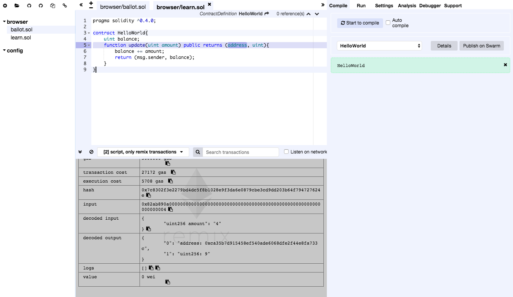
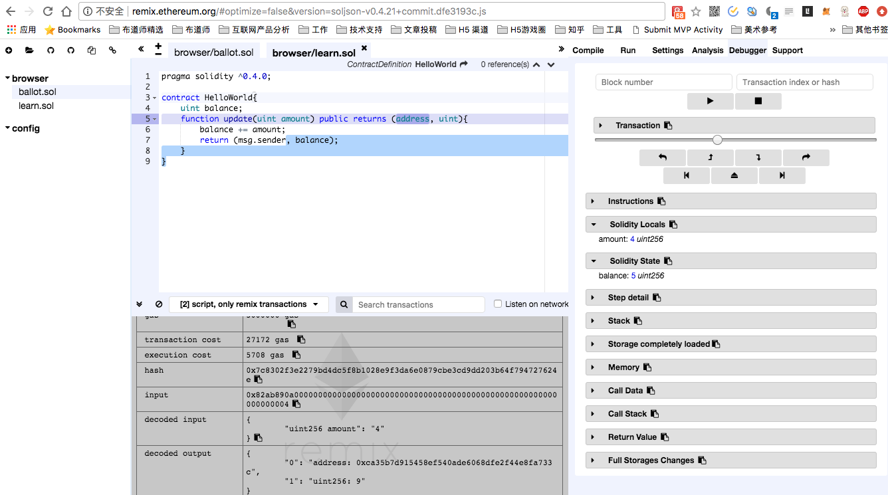

Solidity是一种智能合约高级语言，运行在Ethereum虚拟机（EVM）之上

## Solidity与其它语言相关的特点？

它的语法接近于Javascript，是一种面向对象的语言。但作为一种真正意义上运行在网络上的去中心合约，它又有很多的不同，下面列举一些：

* 以太坊底层是基于帐户，而非UTXO的，所以有一个特殊的Address的类型。用于定位用户，定位合约，定位合约的代码（合约本身也是一个帐户）。
* 由于语言内嵌框架是支持支付的，所以提供了一些关键字，如payable，可以在语言层面直接支持支付，而且超级简单。
* 存储是使用网络上的区块链，数据的每一个状态都可以永久存储，所以需要确定变量使用内存，还是区块链。
* 运行环境是在去中心化的网络上，会比较强调合约或函数执行的调用的方式。因为原来一个简单的函数调用变为了一个网络上的节点中的代码执行，分布式的感觉。
* 最后一个非常大的不同则是它的异常机制，一旦出现异常，所有的执行都将会被回撤，这主要是为了保证合约执行的原子性，以避免中间状态出现的数据不一致。

## Hello Wolrd!

听起来高大上，其实入手玩起来也可以很简单：

    pragma solidity ^0.4.0;

    contract HelloWorld{
        uint balance;
        function update(uint amount) public returns (address, uint){
            balance += amount;
            return (msg.sender, balance);
        }
    }

通过读取参数输入的新值，并将之累加至合约的变量中，返回发送人的地址，和最终的累计值。

## 浏览器编译器Remix

使用无需安装的浏览器编译器[Remix](http://remix.ethereum.org/)可以立即看到效果。打开后，如下图所示：

输入上述代码，点击Create按钮，就能在浏览器中创建能调用函数的按钮。在update按钮旁输入入参，点击按钮，就能执行函数调用并打印出函数返回的结果了。

> 注意，`Environment`选项为`JavaScript VM`

