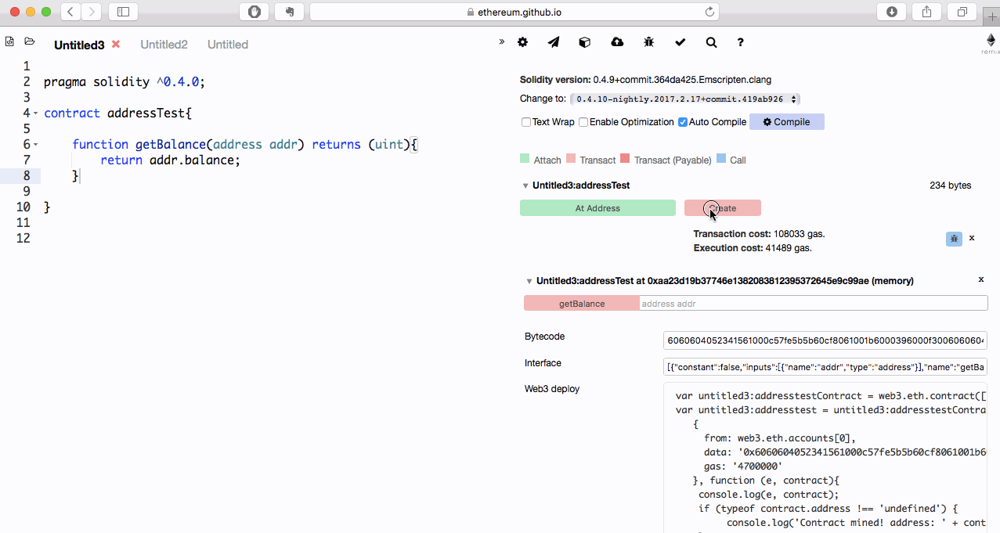

由于Solidity是一个静态类型的语言，所以编译时需明确指定变量的类型（包括本地变量或状态变量），Solidity编程语言提供了一些基本类型(elementary types)可以用来组合成复杂类型。

## 值类型(Value Type)

值类型包含

* 布尔(Booleans)
* 整型(Integer)
* 地址(Address)
* 定长字节数组(fixed byte arrays)
* 有理数和整型(Rational and Integer Literals，String * literals)
* 枚举类型(Enums)
* 函数(Function Types)

为什么会叫值类型，是因为上述这些类型在传值时，总是值传递。比如在函数传参数时，或进行变量赋值时。

## 布尔(Booleans)
bool: 可能的取值为常量值true和false.

支持的运算符：

* ！逻辑非
* && 逻辑与
* || 逻辑或
* == 等于
* ！= 不等于

备注：运算符&&和||是短路运算符，如f(x)||g(y)，当f(x)为真时，则不会继续执行g(y)。

## 整型(Integer)

`int/uint`：变长的有符号或无符号整型。变量支持的步长以8递增，支持从`uint8`到`uint256`，以及`int8`到`int256`。需要注意的是，`uint`和`int`默认代表的是`uint256`和`int256`。

* int：有符号正负256位
* uint：

支持的运算符：

* 比较：<=，<，==，!=，>=，>，返回值为bool类型。
* 位运算符：&，|，（^异或），（~非）。
* 数学运算：+，-，一元运算+，*，/，（%求余），（**平方）。

整数除法总是截断的，但如果运算符是字面量，则不会截断(后面会进一步提到)。

> 另外除0会抛异常

我们来看看下面的这个例子：

    pragma solidity ^0.4.0;

    // simple store example

    contract simpleStorage{

        uint valueStore; //

        function add(uint x, uint y) returns (uint z){
            z = x + y;
        }

        function divide() returns (uint z){
            uint x = 1;
            uint y = 2;
            z = x / y;
        }
    }
#### 字面量

字面量是变量的字符串表示形式。它不是一种值，而是一种变量记法。

    var a = 1; // 1是字面量
    var b = 'css' // css是字面量
    var c = [1,2,3] // [1,2,3]是字面量
    var d = {"foo":"bar"} // {"foo":"bar"}是字面量

#### 整数字面量

整数字面量，由包含0-9的数字序列组成，默认被解释成十进制。在Solidity中不支持八进制，前导0会被默认忽略，如0100，会被认为是100。

小数由.组成，在他的左边或右边至少要包含一个数字。如1.，.1，1.3均是有效的小数。

字面量本身支持任意精度，也就是可以不会运算溢出，或除法截断。但当它被转换成对应的非字面量类型，如整数或小数。或者将他们与非字面量进行运算，则不能保证精度了。

    pragma solidity ^0.4.0;

    contract IntegerLiteral{
        function integerTest() returns (uint, uint){
            //超出运算字长了
            var i = (2**800 + 1) - 2**800;
            var j = 1/3*3;
            //小数运算
            var k = 0.5*8;
            return (i, j);
        }
    }

总之来说就是，字面量怎么都计算都行，但一旦转为对应的变量后，再计算就不保证精度啦。

## 地址(Address)

#### 地址

地址： 以太坊地址的长度，大小20个字节（一个字节八个比特），160位，所以可以用一个uint160编码。地址是所有合约的基础，所有的合约都会继承地址对象，也可以随时将一个地址串，得到对应的代码进行调用。当然地址代表一个普通帐户时，就没有这么多丰富的功能啦。

支持的运算符

    <=，<，==，!=，>=和>

地址类型的成员
    
    属性：balance
    函数：send()，call()，delegatecall()，callcode()。

#### 地址字面量

十六进制的字符串，凡是能通过地址合法性检查（address checksum test）2，就会被认为是地址，如0xdCad3a6d3569DF655070DEd06cb7A1b2Ccd1D3AF。需要注意的是39到41位长的没有通过地址合法性检查的，会提示一个警告，但会被视为普通的有理数字面量。

**balance**

通过它能得到一个地址的余额。

    pragma solidity ^0.4.0;

    contract addressTest{
        
        function getBalance(address addr) returns (uint){
            return addr.balance;
        }

    }

我们可以把上述代码放入remix中，看看效果，参见下面的操作演示：

演示中的一个核心要点是，编译后，我们能得到当前合约的地址，并将该地址复制到输入框中，记得录入地址项时要加英文的双引号，否则会报Error encoding arguments: SyntaxError: JSON Parse error: Expected ']'。

> 最新版已经做了容错，不加双引号也可以

**this**

如果只是想得到当前合约的余额，其实可以这样写：

pragma solidity ^0.4.0;

    contract addressTest{
        
        function getBalance() returns (uint){
            return this.balance;
        }

    }

原因是对于合约来说，地址代表的就是合约本身，合约对象默认继承自地址对象，所以内部有地址的属性。

#### 地址的方法`send()`

用来向某个地址发送货币(货币单位是wei)。

    pragma solidity ^0.4.0;

    //请注意这个仅是Demo，请不要用到正式环境
    contract PayTest {
        //得到当前合约的余额
        function getBalance() returns (uint) {
            return this.balance;//0
        }  
        
        //向当前合约存款
        function deposit() payable returns(address addr, uint amount, bool success){
            //msg.sender 全局变量，调用合约的发起方
            //msg.value 全局变量，调用合约的发起方转发的货币量，以wei为单位。
            //send() 执行的结果
            return (msg.sender, msg.value, this.send(msg.value));
        }
    }

#### Warning 处理

    Using contract member "send" inherited from the address type is deprecated

处理方法

    address(this).balance

#### error 处理

    Value transfer to a contract without a payable fallback function

处理方法

    address(this).send(msg.value);

#### 处理后代码

    pragma solidity ^0.4.0;

    //请注意这个仅是Demo，请不要用到正式环境
    contract PayTest {
        //得到当前合约的余额
        function getBalance() public returns (uint) {
            return address(this).balance;//0
        }  
        
        //向当前合约存款
        function deposit() public payable returns(address addr, uint amount, bool success){
            //msg.sender 全局变量，调用合约的发起方
            //msg.value 全局变量，调用合约的发起方转发的货币量，以wei为单位。
            //send() 执行的结果
            bool _sendSuccess = address(this).send(msg.value);
            return (msg.sender, msg.value, _sendSuccess);
        }
    }

#### 运行

这个合约实现的是充值。this.send(msg.value)意指向合约自身发送msg.value量的以太币。msg.value是合约调用方附带的以太币。

下面是操作演示：

关于发送者的帐号，发送的以太币数量设置，需切换到Remix的小飞机图标的配置页。要在调用deposit前在Value输入项填入要发的以太币数量。在getBalance时要记得将value项内填的值去掉，因为getBalance方法，并不是payable的，不支持货币。

#### send()方法执行时有一些风险

* 调用递归深度不能超1024
* 如果gas不够，执行会失败

所以使用这个方法要检查成功与否。或为保险起见，货币操作时要使用一些最佳实践。

如果执行失败，将会回撤所有交易，所以务必留意返回结果。

#### `call()`，`callcode()`和`delegatecall`()

为了同一些不支持`ABI`协议的进行直接交互（一般的`web3.js`，`soldity`都是支持的）。可以使用`call()`函数，用来向另一个合约发送原始数据。参数支持任何类型任意数量。每个参数会按规则(规则是按`ABI`)打包成32字节并一一拼接到一起。

`call()`方法支持`ABI`协议定义的函数选择器。如果第一个参数恰好4个字节，在这种情况下，会被认为根据`ABI`协议定义的函数器指定的函数签名。所以如果你只是想发送消息体，需要避免第一个参数是4个字节。

`call`方法返回一个`bool`值，以表明执行成功还是失败。正常结束返回`true`，异常终止返回`false`。我们无法解析返回结果，因为这样我们得事前知道返回的数据的编码和数据大小（这里的潜在假设是不知道对方使用的协议格式，所以也不会知道返回的结果如何解析，有点祼协议测试的感觉）。

同样我们也可以使用`delegatecall()`，它与`call`方法的区别在于，仅仅是代码会执行，而其它方面，如（存储，余额等）都是用的当前的合约的数据。`delegatecall()`方法的目的是用来执行另一个合约中的工具库。所以开发者需要保证两个合约中的存储变量能兼容，来保证`delegatecall()`能顺利执行。

在`homestead`阶段之前，仅有一个受限的多样的`callcode()`方法可用，但并未提供对`msg.sender`，`msg.value`的访问权限。

上面的这三个方法`call()`，`delegatecall()`，`callcode()`都是底层的消息传递调用，最好仅在万不得已才进行使用，因为他们破坏了`Solidity`的类型安全。

> 上述的函数都是底层的函数，使用时要异常小心。当调用一个未知的，可能是恶意的合约时，当你把控制权交给它，它可能回调回你的合约，所以要准备好在调用返回时，应对你的状态变量可能被恶意篡改的情况。

如果你想了解更多关于地址的由来，UTXO等，可以参考: 
> http://me.tryblockchain.org/Solidity%E7%9A%84%E5%9C%B0%E5%9D%80%E7%B1%BB%E5%9E%8B.html

为防止录入地址有误，一种格式化地址后来确认地址有效性的方案
> https://github.com/ethereum/EIPs/issues/55

原因详见实现以太币支付的文章
> http://me.tryblockchain.org/%E6%94%AF%E4%BB%98%E7%9B%B8%E5%85%B3.html

关于ABI协议的详细说明
> http://me.tryblockchain.org/Solidity-abi-abstraction.html

## 定长字节数组（Fixed-size byte arrays）

bytes1， ... ，bytes32，允许值以步长1递增。byte默认表示byte1。

#### 运算符

比较：<=，<，==，!=，>=，>，返回值为bool类型。

位运算符：&，|，^(异或)，~非

支持序号的访问，与大多数语言一样，取值范围[0, n)，其中n表示长度。

#### 成员变量

.length表示这个字节数组的长度（只读）。

#### 动态大小的字节数组

bytes： 动态长度的字节数组，参见数组(Arrays)。非值类型1。

string： 动态长度的UTF-8编码的字符类型，参见数组(Arrays)。非值类型1。

一个好的使用原则是:

* bytes用来存储任意长度的字节数据，string用来存储任意长度的UTF-8编码的字符串数据。
* 如果长度可以确定，尽量使用定长的如byte1到byte32中的一个，因为这样更省空间。

## 小数

#### 小数字面量

如果字面量计算的结果不是一个整数，那么将会转换为一个对应的ufixed，或fixed类型。Solidity会选择合适的大小，以能尽量包含小数部分。

例，在var x = 1 / 4中，x的实际类型是ufixed0x8。而在var x = 1/ 3中，类型会是ufixedox256，因为这个结果表示是无限的，所以他只能是无限接近。

#### 支持的运算符

适用于整型的操作符，同时适用于数字的字面量运算表达式，当操作结果是整数时。如果有任何一方是有理数，将不允许使用位操作符。如果指数是小数，还将不能进行取幂运算。

#### 数字字面量

Solidity对每一个有理数都有一个数值字面量类型。整数字面量和有理数字面量从属于数字面量。所有的数字字面表式的结果都属于数字字面类型。所以1 + 2和2 + 1都属于同样的有理数的数字字面类型3

#### 二进制表示

大多数含小数的十进制，均不可被二进制准确表达，比如5.3743的类型可能是ufixed8*248。如果你想使用这样的值，需要明确指定精度x + ufixed(5.3743)，否则会报类型转换错误。

#### 字面量截断

整数上的字面量除法，在早期的版本中是被截断的，但现在可以被转为有理数了，如5 /2的值为 2.5。

#### 字面量转换

数字的字面量表达式，一旦其中含有非字面量表达式，它就会被转为一个非字面量类型。下面代码中表达式的结果将会被认为是一个有理数：

    pragma solidity ^0.4.0;

    contract IntegerLiteralConvert{
    function literalTest(){
        uint128 a = 1;
        //uint128 b = 2.5 + a + 0.5;
        //Error: Operator + not compatible with types rational_const 5/2 and uint128
    }
    }

虽然我们知道上述表达式运算的结果将是一个整型，但最终被编译器认为是小数型，所以上述代码编译不能通过。

## 字符串(String literal)

#### 字符串字面量

字符串字面量是指由单引号，或双引号引起来的字符串。字符串并不像C语言，包含结束符，foo这个字符串大小仅为三个字节。

#### 定长字节数组

正如整数一样，字符串的长度类型可以是变长的。特殊之处在于，可以隐式的转换为byte1,...byte32。下面来看看这个特性：

    pragma solidity ^0.4.0;

    contract StringConvert{
        function test() returns (bytes3){
            bytes3 a = "123";

            //bytes3 b = "1234";
            //Error: Type literal_string "1234" is not implicitly convertible to expected type bytes3.

            return a;
        }
    }

上述的字符串字面量，会隐式转换为bytes3。但这样不是理解成bytes3的字面量方式一个意思。

#### 转义字符

字符串字面量支持转义字符，比如\n，\xNN，\uNNNN。其中\xNN表式16进制值，最终录入合适的字节。而\uNNNN表示Unicode码点值，最终会转换为UTF8的序列。

## 十六进制字面量

十六进制字面量，以关键字hex(hexadecimal：十六进制)打头，后面紧跟用单或双引号包裹的字符串。如hex"001122ff"。在内部会被表示为二进制流。通过下面的例子来理解下是什么意思：

    pragma solidity ^0.4.0;

    contract HexLiteral{
        function test() returns (string){
            var a = hex"001122FF";

            //var b = hex"A";
            //Expected primary expression
            
            return a;
        }
    }

由于一个字节是8位，所以一个hex是由两个[0-9a-z]字符组成的。所以var b = hex"A";不是成双的字符串是会报错的。

#### 转换

十六进制的字面量与字符串可以进行同样的类似操作：

    pragma solidity ^0.4.0;

    contract HexLiteralBytes{
        function test() returns (bytes4, bytes1, bytes1, bytes1, bytes1){
            bytes4 a = hex"001122FF";

            return (a, a[0], a[1], a[2], a[3]);
        }
    }

可以发现，它可以隐式的转为bytes，上述代码的执行结果如下：

    Result: "0x001122ff00000000000000000000000000000000000000000000000000000000000000000000000000000000000000000000000000000000000000000000000011000000000000000000000000000000000000000000000000000000000000002200000000000000000000000000000000000000000000000000000000000000ff00000000000000000000000000000000000000000000000000000000000000"
    Transaction cost: 21857 gas. 
    Execution cost: 585 gas.
    Decoded: 
    bytes4: 0x001122ff
    bytes1: 0x00
    bytes1: 0x11
    bytes1: 0x22
    bytes1: 0xff

## 枚举

枚举类型是在Solidity中的一种用户自定义类型。他可以显示的转换与整数进行转换，但不能进行隐式转换。显示的转换会在运行时检查数值范围，如果不匹配，将会引起异常。枚举类型应至少有一名成员。我们来看看下面的例子吧。

    pragma solidity ^0.4.0;

    contract test {
        enum ActionChoices { GoLeft, GoRight, GoStraight, SitStill }
        ActionChoices choice;
        ActionChoices constant defaultChoice = ActionChoices.GoStraight;

        function setGoStraight() {
            choice = ActionChoices.GoStraight;
        }

        // Since enum types are not part of the ABI, the signature of "getChoice"
        // will automatically be changed to "getChoice() returns (uint8)"
        // for all matters external to Solidity. The integer type used is just
        // large enough to hold all enum values, i.e. if you have more values,
        // `uint16` will be used and so on.
        function getChoice() returns (ActionChoices) {
            return choice;
        }

        function getDefaultChoice() returns (uint) {
            return uint(defaultChoice);
        }
    }

## 函数(Function Types)

函数类型即是函数这种特殊的类型。

* 可以将一个函数赋值给一个变量，一个函数类型的变量。
* 还可以将一个函数作为参数进行传递。
* 也可以在函数调用中返回一个函数。

函数类型有两类;可分为internal和external函数。

#### 内部函数(internal)

因为不能在当前合约的上下文环境以外的地方执行，内部函数只能在当前合约内被使用。如在当前的代码块内，包括内部库函数，和继承的函数中。

#### 外部函数（External）

外部函数由地址和函数方法签名两部分组成。可作为外部函数调用的参数，或者由外部函数调用返回。

#### 函数的定义

完整的函数的定义如下:

    function (<parameter types>) {internal(默认)|external} [constant] [payable] [returns (<return types>)]

若不写类型，默认的函数类型是internal的。如果函数没有返回结果，则必须省略returns关键字。下面我们通过一个例子来了解一下。

    pragma solidity ^0.4.0;

    contract Test{
        //默认是internal类型的
        function noParameter() returns (uint){}

        //无返回结果
        function noReturn1(uint x) {}

        //如果无返回结果，必须省略`returns`关键字
        //function noReturn2(uint x) returns {} 
    }

如果一个函数变量没有初始化，直接调用它将会产生异常。如果delete了一个函数后调用，也会发生同样的异常。

如果外部函数类型在Solidity的上下文环境以外的地方使用，他们会被视为function类型。编码为20字节的函数所在地址，紧跟4字节的函数方法签名2的共占24字节的bytes24类型。

合约中的public的函数，可以使用internal和external两种方式来调用。下面来看看，两种方式的不同之处。

#### 函数的internal与external：

调用一个函数f()时，我们可以直接调用f()，或者使用this.f()。但两者有一个区别。前者是通过internal的方式在调用，而后者是通过external的方式在调用。请注意，这里关于this的使用与大多数语言相背。下面通过一个例子来了解他们的不同：

    pragma solidity ^0.4.5;

    contract FuntionTest{
        function internalFunc() internal{}

        function externalFunc() external{}

        function callFunc(){
            //直接使用内部的方式调用
            internalFunc();

            //不能在内部调用一个外部函数，会报编译错误。
            //Error: Undeclared identifier.
            //externalFunc();

            //不能通过`external`的方式调用一个`internal`
            //Member "internalFunc" not found or not visible after argument-dependent lookup in contract FuntionTest
            //this.internalFunc();

            //使用`this`以`external`的方式调用一个外部函数
            this.externalFunc();
        }
    }
    contract FunctionTest1{
        function externalCall(FuntionTest ft){
            //调用另一个合约的外部函数
            ft.externalFunc();
            
            //不能调用另一个合约的内部函数
            //Error: Member "internalFunc" not found or not visible after argument-dependent lookup in contract FuntionTest
            //ft.internalFunc();
        }
    }

#### 函数例子（官方）

    pragma solidity ^0.4.0;

    library ArrayUtils{
        function range(uint length) internal returns (uint[] memory r){
            r = new uint;
            
            for(uint i = 0; i < length; i++){
                r[i] = i;
            }
        }
        
        function map(uint[] memory self, 
            function(uint) returns (uint) f
        ) 
            internal 
            returns (uint[] memory r)
        {
                r = new uint;
                for(uint i = 0; i < self.length; i++){
                    r[i] = f(self[i]);
                }
        }
        
        function reduce(uint[] memory self,
            function(uint x, uint y) returns(uint) f
        )
            internal
            returns (uint r)
        {
            r = self[0];
            for(uint i = 1; i < self.length; i++){
                r = f(r, self[i]);
            }
        }
    }

    contract Pyramid{
        using ArrayUtils for *;
        
        function pryamid(uint length) returns (uint){
            return ArrayUtils.range(length).map(square).reduce(sum);
        }
        
        function square(uint x) returns (uint){
            return x * x;
        }
        
        function sum(uint x, uint y) returns (uint){
            return x + y;
        }
    }

#### Question?

* library是什么呢。
* library引入时为什么使用using，这和文件引入的import有何区别。
* library内的函数全是internal的。
* library内的函数，他的参数函数为什么是internal的，不应该是external的？
* uint[]是什么类型，不能写做[]uint
* memory又是什么呢，为什么map函数明明是两个参数，但只需要传一个呢。