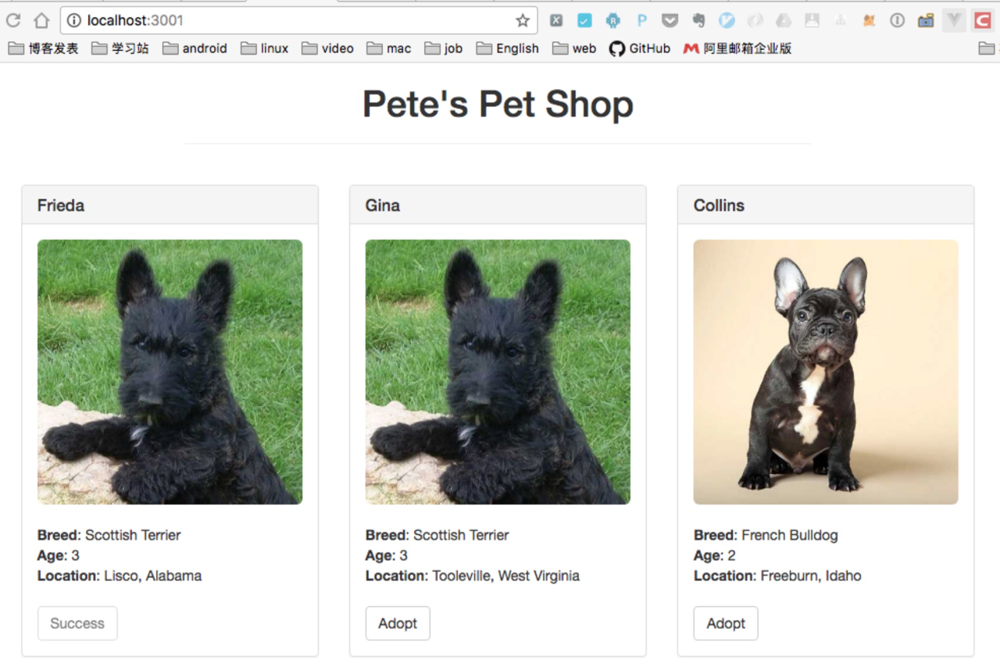
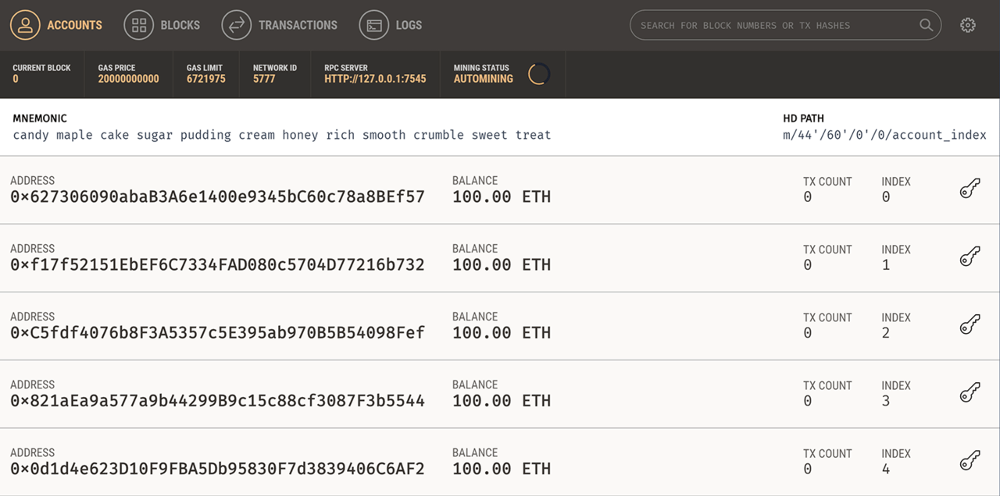
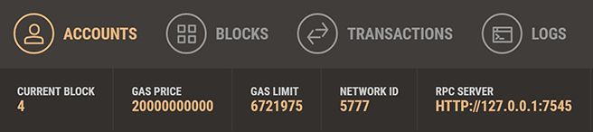
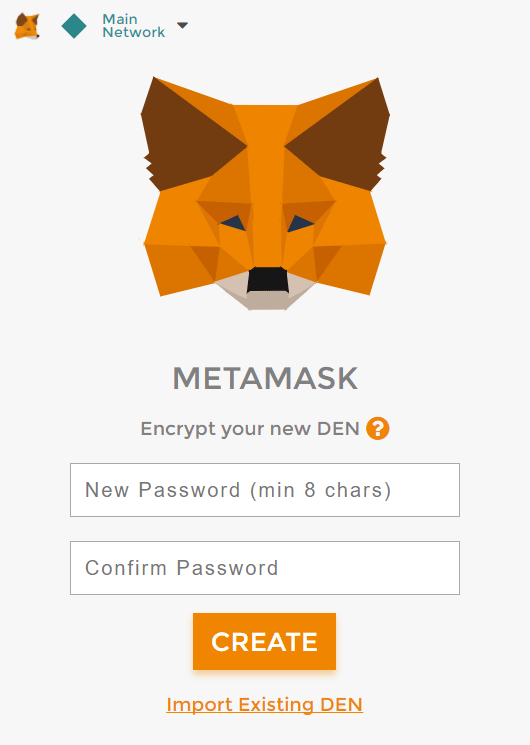
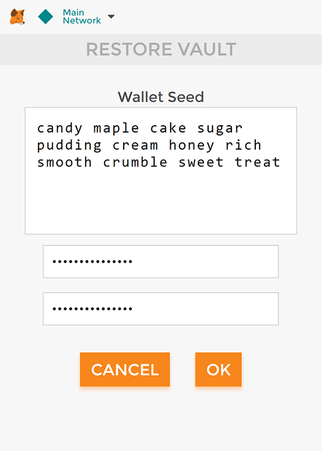
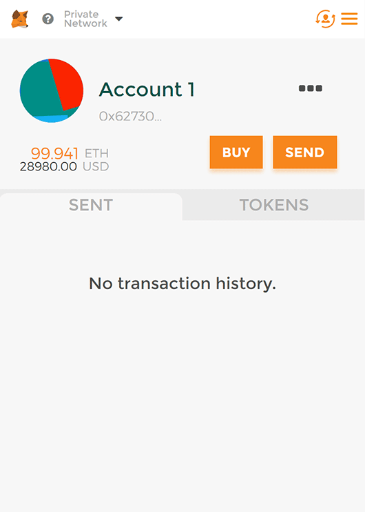
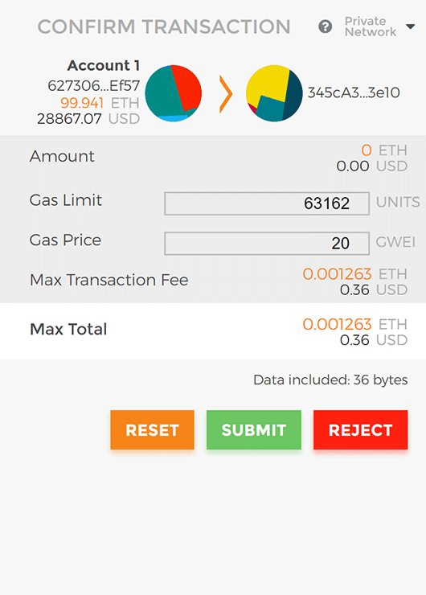
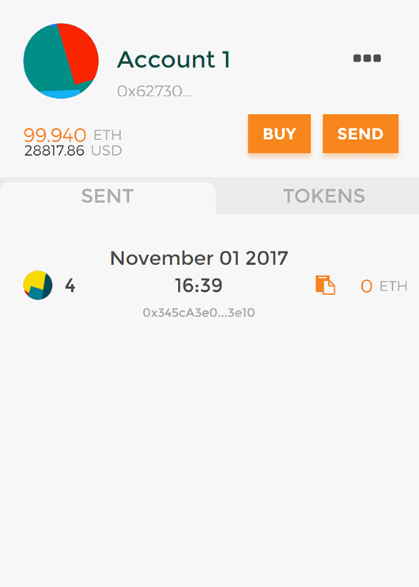

# 宠物商店部署教程

## 写在前面

阅读本文前，你应该对以太坊、智能合约有所了解，如果你还不了解，建议你先看以太坊是什么

除此之外，你最好还了解一些HTML及JavaScript知识。

本文通过实例教大家来开发去中心化应用，应用效果如图：

从本文，你可以学习到：

* 搭建智能合约开发环境
* 创建Truffle项目
* 编写智能合约
* 编译和部署智能合约到区块链
* 如何通过Web3和智能合约交互
* MetaMask 的使用

## 项目背景

Pete有一个宠物店，有16只宠物，他想开发一个去中心化应用，让大家来领养宠物。
在truffle box中，已经提供了pet-shop的网站部分的代码，我们只需要编写合约及交互部分。

## 环境搭建

1. 安装 Node
2. 安装 Truffle ：npm install -g truffle
3. 安装 Ganache

> Ganache（或Ganache CLI）已经取代了 testrpc。

## 创建项目

1. 建立项目目录并进入

> mkdir pet-shop-tutorial
> cd pet-shop-tutorial

2. 使用truffle unbox 创建项目

 > truffle unbox pet-shop
 Downloading...
 Unpacking...
 Setting up...
 Unbox successful. Sweet!

3. Commands:

  Compile:        truffle compile
  Migrate:        truffle migrate
  Test contracts: truffle test
  Run dev server: npm run dev

这一步需要等待一会

    也可以使用truffle init 来创建一个全新的项目。

## 项目目录结构

* contracts/ 智能合约的文件夹，所有的智能合约文件都放置在这里，里面包含一个重要的合约Migrations.sol（稍后再讲）
* migrations/ 用来处理部署（迁移）智能合约 ，迁移是一个额外特别的合约用来保存合约的变化。
* test/ 智能合约测试用例文件夹
* truffle.js/ 配置文件

其他代码可以暂时不用管

## 编写智能合约

智能合约承担着分布式应用的后台逻辑和存储。智能合约使用solidity编写，可阅读solidity系列文章

在contracts目录下，添加合约文件Adoption.sol

    pragma solidity ^0.4.17;

        contract Adoption {

        address[16] public adopters;  // 保存领养者的地址

            // 领养宠物
        function adopt(uint petId) public returns (uint) {
            require(petId >= 0 && petId <= 15);  // 确保id在数组长度内

            adopters[petId] = msg.sender;        // 保存调用这地址 
            return petId;
        }

        // 返回领养者
        function getAdopters() public view returns (address[16]) {
            return adopters;
        }

    }

## 编译部署智能合约

Truffle集成了一个开发者控制台，可用来生成一个开发链用来测试和部署智能合约。

#### 编译

Solidity是编译型语言，需要把可读的Solidity代码编译为EVM字节码才能运行。
dapp的根目录pet-shop-tutorial下，

> truffle compile

#### 输出

    Compiling ./contracts/Adoption.sol...
    Writing artifacts to ./build/contracts

#### 部署

编译之后，就可以部署到区块链上。
在migrations文件夹下已经有一个1_initial_migration.js部署脚本，用来部署Migrations.sol合约。
Migrations.sol 用来确保不会部署相同的合约。

现在我们来创建一个自己的部署脚本
> 2_deploy_contracts.js

    var Adoption = artifacts.require("Adoption");

    module.exports = function(deployer) {
    deployer.deploy(Adoption);
    };

在执行部署之前，需要确保有一个区块链运行, 可以使用
Ganache来开启一个私链来进行开发测试，默认会在7545端口上运行一个开发链。
Ganache 启动之后是这样：

接下来执行部署命令:

> truffle  migrate

执行后，有一下类似的输出，

    Using network 'develop'.

    Running migration: 1_initial_migration.js
    Deploying Migrations...
    ... 0x3076b7dac65afc44ec51508bf6f2b6894f833f0f9560ecad2d6d41ed98a4679f
    Migrations: 0x8cdaf0cd259887258bc13a92c0a6da92698644c0
    Saving successful migration to network...
    ... 0xd7bc86d31bee32fa3988f1c1eabce403a1b5d570340a3a9cdba53a472ee8c956
    Saving artifacts...
    Running migration: 2_deploy_contracts.js
    Deploying Adoption...
    ... 0x2c6ab4471c225b5473f2079ee42ca1356007e51d5bb57eb80bfeb406acc35cd4
    Adoption: 0x345ca3e014aaf5dca488057592ee47305d9b3e10
    Saving successful migration to network...
    ... 0xf36163615f41ef7ed8f4a8f192149a0bf633fe1a2398ce001bf44c43dc7bdda0
    Saving artifacts...

在打开的Ganache里可以看到区块链状态的变化，现在产生了4个区块。

这时说明已经智能合约已经部署好了。

#### 测试

现在我们来测试一下智能合约，测试用例可以用 JavaScript or Solidity来编写，这里使用Solidity。

在test目录下新建一个TestAdoption.sol，编写测试合约

    pragma solidity ^0.4.17;

    import "truffle/Assert.sol";   // 引入的断言
    import "truffle/DeployedAddresses.sol";  // 用来获取被测试合约的地址
    import "../contracts/Adoption.sol";      // 被测试合约

    contract TestAdoption {
        Adoption adoption = Adoption(DeployedAddresses.Adoption());

        // 领养测试用例
        function testUserCanAdoptPet() public {
            uint returnedId = adoption.adopt(8);

            uint expected = 8;
            Assert.equal(returnedId, expected, "Adoption of pet ID 8 should be recorded.");
        }

        // 宠物所有者测试用例
        function testGetAdopterAddressByPetId() public {
            // 期望领养者的地址就是本合约地址，因为交易是由测试合约发起交易，
            address expected = this;
            address adopter = adoption.adopters(8);
            Assert.equal(adopter, expected, "Owner of pet ID 8 should be recorded.");
        }

            // 测试所有领养者
        function testGetAdopterAddressByPetIdInArray() public {
        // 领养者的地址就是本合约地址
            address expected = this;
            address[16] memory adopters = adoption.getAdopters();
            Assert.equal(adopters[8], expected, "Owner of pet ID 8 should be recorded.");
        }
    }

Assert.sol 及 DeployedAddresses.sol是Truffle框架提供，在test目录下并不提供truffle目录。

TestAdoption合约中添加adopt的测试用例

#### 运行测试用例

在终端中，执行

> truffle test

如果测试通过，则终端输出：

    Using network 'develop'.

    Compiling ./contracts/Adoption.sol...
    Compiling ./test/TestAdoption.sol...
    Compiling truffle/Assert.sol...
    Compiling truffle/DeployedAddresses.sol...

    TestAdoption
        ✓ testUserCanAdoptPet (62ms)
        ✓ testGetAdopterAddressByPetId (53ms)
        ✓ testGetAdopterAddressByPetIdInArray (73ms)

    3 passing (554ms)

#### 创建用户接口和智能合约交互

我们已经编写和部署及测试好了我们的合约，接下我们为合约编写UI，让合约真正可以用起来。

在Truffle Box pet-shop里，已经包含了应用的前端代码，代码在src/文件夹下。

在编辑器中打开src/js/app.js
可以看到用来管理整个应用的App对象，init函数加载宠物信息，就初始化web3.
web3是一个实现了与以太坊节点通信的库，我们利用web3来和合约进行交互。

#### 初始化web3

接下来，我们来编辑app.js修改initWeb3():
删除注释，修改为：

  initWeb3: function() {
    // Is there an injected web3 instance?
    if (typeof web3 !== 'undefined') {
      App.web3Provider = web3.currentProvider;
    } else {
      // If no injected web3 instance is detected, fall back to Ganache
      App.web3Provider = new Web3.providers.HttpProvider('http://localhost:7545');
    }
    web3 = new Web3(App.web3Provider);

    return App.initContract();
  }

代码中优先使用Mist 或 MetaMask提供的web3实例，如果没有则从本地环境创建一个。

#### 实例化合约

使用truffle-contract会帮我们保存合约部署的信息，就不需要我们手动修改合约地址，修改initContract()代码如下：

    initContract: function() {
    // 加载Adoption.json，保存了Adoption的ABI（接口说明）信息及部署后的网络(地址)信息，它在编译合约的时候生成ABI，在部署的时候追加网络信息
    $.getJSON('Adoption.json', function(data) {
        // 用Adoption.json数据创建一个可交互的TruffleContract合约实例。
        var AdoptionArtifact = data;
        App.contracts.Adoption = TruffleContract(AdoptionArtifact);

        // Set the provider for our contract
        App.contracts.Adoption.setProvider(App.web3Provider);

        // Use our contract to retrieve and mark the adopted pets
        return App.markAdopted();
    });
    return App.bindEvents();
    }

#### 处理领养

修改markAdopted()代码：

  markAdopted: function(adopters, account) {
    var adoptionInstance;

    App.contracts.Adoption.deployed().then(function(instance) {
      adoptionInstance = instance;

      // 调用合约的getAdopters(), 用call读取信息不用消耗gas
      return adoptionInstance.getAdopters.call();
    }).then(function(adopters) {
      for (i = 0; i < adopters.length; i++) {
        if (adopters[i] !== '0x0000000000000000000000000000000000000000') {
          $('.panel-pet').eq(i).find('button').text('Success').attr('disabled', true);
        }
      }
    }).catch(function(err) {
      console.log(err.message);
    });
  }

修改handleAdopt()代码：

  handleAdopt: function(event) {
    event.preventDefault();

    var petId = parseInt($(event.target).data('id'));

    var adoptionInstance;

    // 获取用户账号
    web3.eth.getAccounts(function(error, accounts) {
      if (error) {
        console.log(error);
      }

      var account = accounts[0];

      App.contracts.Adoption.deployed().then(function(instance) {
        adoptionInstance = instance;

        // 发送交易领养宠物
        return adoptionInstance.adopt(petId, {from: account});
      }).then(function(result) {
        return App.markAdopted();
      }).catch(function(err) {
        console.log(err.message);
      });
    });
  }

## 在浏览器中运行

#### 安装 MetaMask

MetaMask 是一款插件形式的以太坊轻客户端，开发过程中使用MetaMask和我们的dapp进行交互是个很好的选择，通过此链接安装，安装完成后，浏览器工具条会显示一个小狐狸图标。

#### 配置钱包

在接受隐私说明后，会出现页面如下：

这里我们通过还原一个Ganache为我们创建好的钱包，作为我们的开发测试钱包。点击页面的** Import Existing DEN**，输入Ganache显示的助记词。

    candy maple cake sugar pudding cream honey rich smooth crumble sweet treat

然后自己想要的密码，点击OK。
如图：

#### 连接开发区块链网络

默认连接的是以太坊主网（左上角显示），选择Custom RPC，添加一个网络：，点返回后，显示如下：

这是左上角显示为Private Network**，账号是Ganache中默认的第一个账号。

至此MetaMask的安装，配置已经完成。

#### 安装和配置lite-server

接下来需要本地的web 服务器提供服务的访问， Truffle Box pet-shop里提供了一个lite-server可以直接使用，我们看看它是如何工作的。
bs-config.json指示了lite-server的工作目录。

    {
    "server": {
        "baseDir": ["./src", "./build/contracts"]
    }
    }

./src 是网站文件目录
./build/contracts 是合约输出目录

以此同时，在package.json文件的scripts中添加了dev命令：

    "scripts": {
    "dev": "lite-server",
    "test": "echo \"Error: no test specified\" && exit 1"
    },

当运行npm run dev的时候，就会启动lite-server

#### 启动服务

> npm run dev

会自动打开浏览器显示我们的dapp，如本文的第一张图。
现在领养一直宠物看看，当我们点击Adopt时，MetaMask会提示我们交易的确认，如图：

点击Submit确认后，就可以看到成功领养了这次宠物。

在MetaMask中，也可以看到交易的清单：

好了，恭喜你，即将成为一名去中心化式应用开发者的你已经成为迈出了坚实的一步。