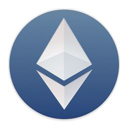

    

    
    
    

# 以太坊开发资源汇总 

Web3.js、Solidity、Truffle教程及 ETH 开发资源汇总💯

## Web3.js 入门

ETH 入门需要学习的第一部分，由于 Web3.js、testrpc 更新问题会导致有些示例跑不起来，但是我尽量标注出来需要如何处理。

* [环境配置](./1_Web3.js/1_环境配置.md)
* [第一个例子](./1_Web3.js/2_第一个例子.md)
* [源码](./1_Web3.js/learn/app.js)

## Solidity 教程

ETH 的智能合约编写语言，类似于 JS、Java

* [Solidity](./2_Solidity/1_Solidity.md)
* [Solidity智能合约文件结构](./2_Solidity/2_Solidity智能合约文件结构.md)
* [Solidity基本概念](./2_Solidity/3_Solidity基本概念.md)
* [数值类型](./2_Solidity/4_数值类型.md)
* [引用类型](./2_Solidity/5_引用类型.md)
* [其它](./2_Solidity/6_其它.md)
* [单位](./2_Solidity/7_单位.md)
* [语言内置特性](./2_Solidity/8_语言内置特性.md)
* [高级特性](./2_Solidity/9_高级特性.md)
* [合约](./2_Solidity/10_合约.md)
* [其它高级特性](./2_Solidity/11_其它高级特性.md)

## 实战案例教程

能够真正跑起来的实战案例

* 宠物商店实战

## Truffle 教程

待续

## 开发工具

* [智能合约编辑器 remix](http://remix.ethereum.org/)
开发智能合约的IDE，基于浏览器。适合新手(版本控制、存储等不便)。(Mix停止更新，browser-solidity也停止更新，都使用Remix了)

* [测试区块链工具 Ganache](http://truffleframework.com/ganache/)
Ethereum Wallet：

* [go-ethereu](https://ethereum.github.io/go-ethereum/)
以太坊Go语言版本的源码（也叫Client，注意区块链网络里没有服务端）。

* [Geth](https://geth.ethereum.org/downloads/)
go-ethereum的命令行终端，能调用go-ethereum的API。可以通过多种方式获得，比如用homebrew安装、下载可执行二进制文件、通过go install/make geth go-ethereum源码等方式得到geth。

* [Ethereum Wallet](https://ethereumwallet.com/)
可视化的Geth（以太坊钱包），可以管理账户、发布合约。

## 相关资源汇总

其它参考的、收集的资料汇总，希望能够帮助大家

#### 实战案例资源

* [10分钟完成阿里云环境搭建以太坊私有链](https://zhuanlan.zhihu.com/p/32911405)
* [基于以太坊的投票案例](http://www.cnblogs.com/duhuo/p/7449778.html)
* [基于truffle框架实现的etehreum投票系统](https://blog.csdn.net/xxxslinyue/article/details/79223703)
* [如何在Ethereum上编写自己的CryptoKitties风格的游戏](https://blog.csdn.net/mergerly/article/details/79088423)

#### 其它资源收集

* [CryptoKittes（加密猫，谜恋猫）智能合约结构和源码解析](https://blog.csdn.net/marising/article/details/79458403)
* [以太坊开发资源汇总](https://www.v2ex.com/amp/t/436426)

#### 学习网站推荐

* [深入浅出区块链](https://learnblockchain.cn/)
* [区块链技术博客](http://me.tryblockchain.org/)

## Tips

有任何建议请联系我
邮箱：dily3825002@163.com